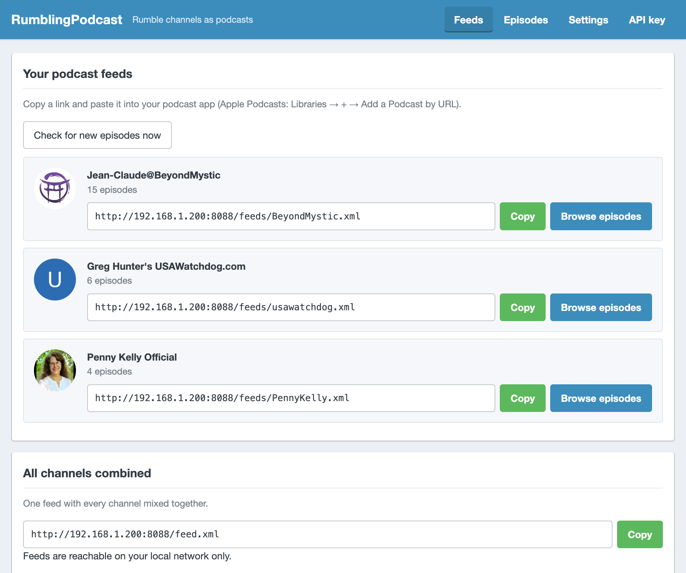
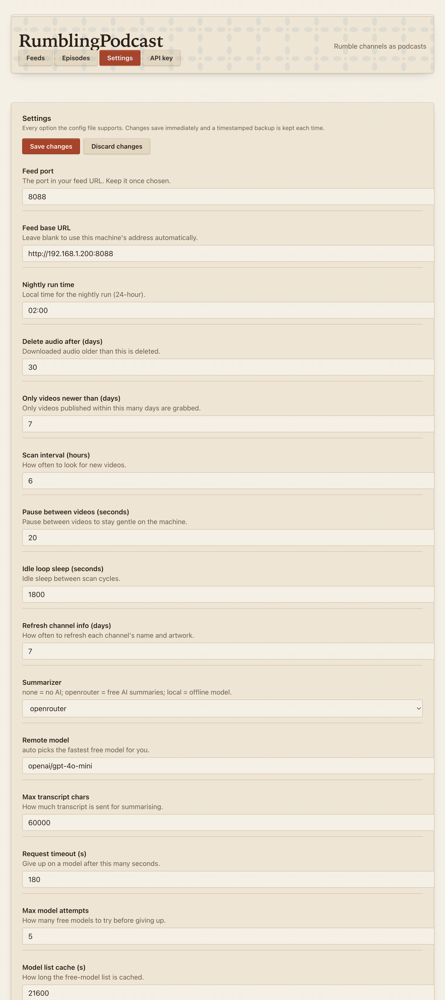
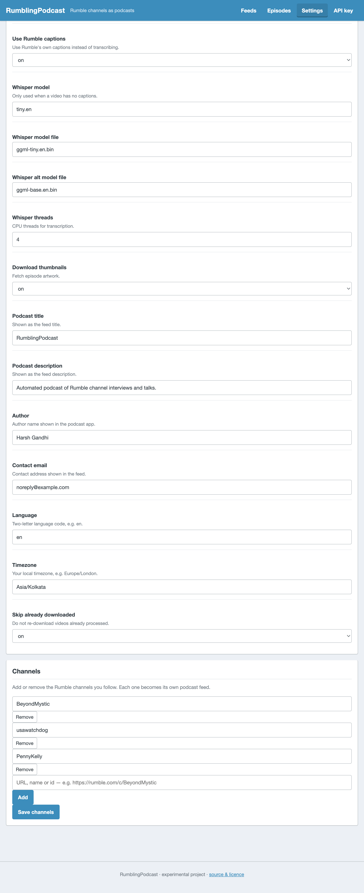
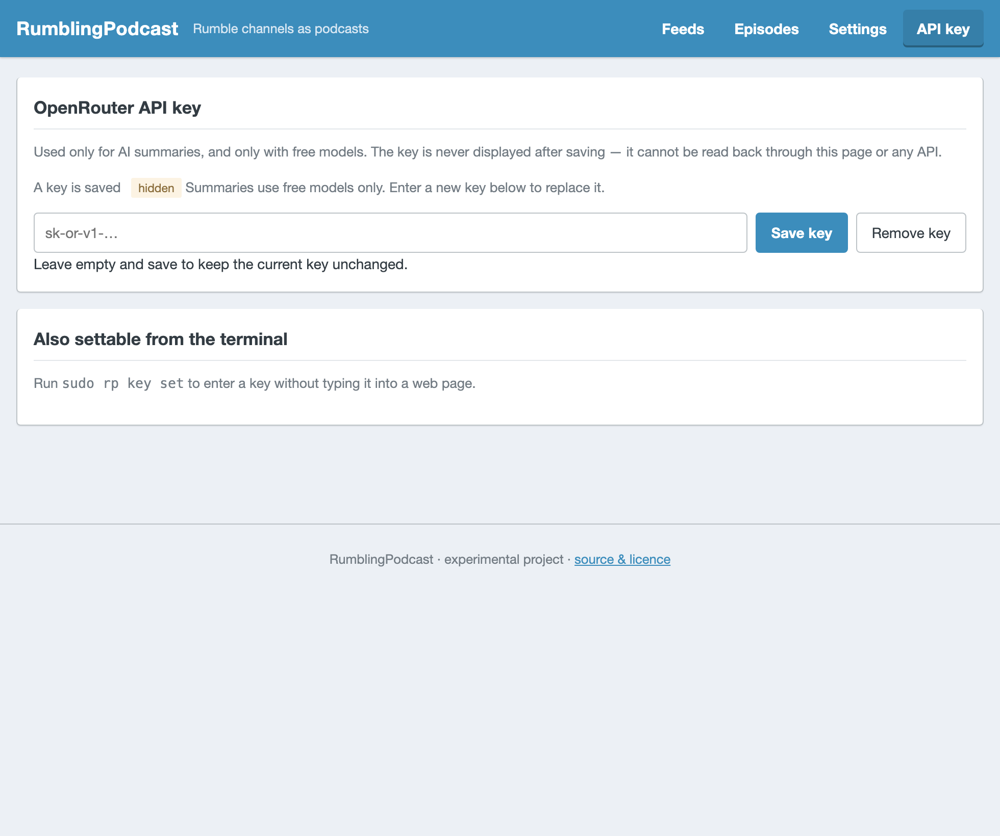

# RumblingPodcast

Turn any Rumble channel into a podcast you can listen to in Apple Podcasts — with
transcripts and AI-written summaries, on a Raspberry Pi that costs almost no
electricity and barely touches your Wi-Fi.

It runs on a Pi Zero 2 W sitting next to Pi-hole without slowing it down.

---

## What it actually does

Once a night, automatically:

1. Checks the Rumble channels you chose for videos published in the last week.
2. Skips anything it has already downloaded.
3. Downloads **audio only** (not the video — much smaller and faster).
4. Pulls the transcript from Rumble's own captions (no slow speech-to-text needed).
5. Writes a short summary of the episode's main points.
6. Publishes everything to an RSS feed your podcast app can subscribe to.

You get a normal podcast: artwork, episode descriptions, and a **transcript you
can scroll and tap** — tap any line and playback jumps to that moment.

Old audio is deleted automatically after 30 days (you can change this).
Transcripts are always kept.

---

## Requirements

- A Linux machine. A Raspberry Pi is ideal, and a Pi Zero 2 W is enough.
- About **250 MB of free disk**.
- `sudo` access.
- Roughly **150 MB of free RAM**. It will *not* fight your other services for
  memory.
- An internet connection.

It has been tested on Raspberry Pi OS / Debian 13 on a Pi Zero 2 W running
Pi-hole. It should work on other Debian/Ubuntu machines too.

**Pi-hole users:** RumblingPodcast is designed to coexist. It never touches
Pi-hole, never uses ports 53/80/443, and the installer automatically picks a free
port for its own feed.

---

## Install

Copy and paste this one line into your terminal, then press Enter:

```bash
curl -fsSL https://raw.githubusercontent.com/iharshgandhi/RumblingPodcast/main/install.sh | sudo bash
```

(On Windows 10/11, use WSL. On macOS, open Terminal.)

That's it. The installer will:

- check your system is suitable,
- ask a few simple questions,
- install everything it needs,
- set up a nightly schedule,
- print the feed URL for your podcast app.

The questions:

| Question | What it means |
|---|---|
| **Which channels?** | Paste a Rumble channel URL or name. Separate several with spaces. |
| **Summaries?** | `free AI via OpenRouter` (recommended), `no AI` (lightest), or `local AI model` (needs lots of RAM). |
| **What time nightly?** | e.g. `02:00`. A systemd timer does the scheduling — you never touch cron. |
| **Which port?** | The port in your feed URL, e.g. `8088`. See below. |

### About the port

You pick the port once, at install, and **it stays that way.** The installer
reads the port already in your config first, so re-running it later — to
upgrade, or to change something else — will not quietly move a feed your
podcast app has already subscribed to. The same applies to reboots: the server
reads the port from your config on every start, so it comes back on the same
port every time.

The installer refuses ports that are already in use and protects Pi-hole's
ports (`53`, `80`, `443`) so it can't break your DNS. It also leaves `8080` and
`8081` alone, since those are what Pi-hole's own web interface uses.

If you genuinely need to change it later, change it in the web page's
**Settings** tab and run `sudo rp restart`. Podcast apps have to be told about
the new URL, so treat it as a deliberate move rather than a routine setting.

It finishes by printing something like:

```
    Add this URL to your podcast app:

        http://192.168.1.42:8088/feed.xml
```

### About the OpenRouter key (optional)

Choosing **free AI via OpenRouter** asks for an API key. Get a free one at
<https://openrouter.ai/keys> (sign in, click *Create Key*).

RumblingPodcast **only ever selects models that are completely free.** It reads
OpenRouter's live model list, filters to zero-cost models, tries the fastest
first, and automatically falls back to the next if one is busy. It will never
choose a paid model. Press Enter to skip — you can add the key later with
`sudo rp key set`.

If you'd rather avoid API keys entirely, pick **no AI** — you'll still get
transcripts, artwork and a basic extractive summary.

---

## The web page — everything without touching the terminal

Open `http://<your-pi-address>:<port>` in any browser. The installer prints the
exact address, and `rp status` shows it later.



### Check for new episodes now

You do not have to wait for the nightly run. Press **Check for new episodes
now** and it starts a scan immediately. The button disables itself and tells
you it has started, because a scan can take several minutes — downloading
audio, pulling transcripts and summarising. Reload the page in a while to see
the new episodes.

The nightly timer and this button never run at the same time, so pressing it
while an automatic run is already in progress is safe.

### Copy a feed URL

Each channel has its own feed URL in a box, with a **Copy** button beside it.
Press **Copy**, then in Apple Podcasts go to **Libraries** → **+** → **Add a
Podcast by URL** and paste.

The page is served over plain HTTP on your own network, so browsers treat it as
an insecure origin and block the modern clipboard API. The button handles this:
it uses the clipboard where available and otherwise selects the text and tells
you to press Ctrl+C. Either way you get the URL without typing it by hand.

### Change settings in the browser

Everything the config file supports is editable here — retention, how often it
runs, whether it summarises, podcast title and author, and so on.





Changes save the moment you press **Save changes**, and a timestamped backup of
the previous file is kept each time. If you break something, the terminal's
`rp status` and `rp doctor` still work, and the backups are in
`/opt/rumblingpodcast/config/`.

Changing the **port** or the **feed base URL** needs a restart to take effect —
the page tells you to run `sudo rp restart`.

### The OpenRouter key

The key can be set or replaced in the browser, but it is **never displayed
back to you**. You can see that one is saved; you cannot read it out of the
page, and it is not sent to the browser in any form.



Worth knowing: this is a small tool with no login, running on your own
network. Anyone who can reach the port can change your settings. Keep it on a
trusted home network and don't port-forward it. If you ever need to, set up a
tunnel with a login rather than exposing the port directly.

Transcripts appear automatically in Apple Podcasts — tap the transcript button
on the player and scroll; tap a line to jump there.

### Off-LAN listening

The feed URL only works while you're on your **home network**. To listen
anywhere, put it behind a free HTTPS tunnel. See [Off-LAN listening](#off-lan-listening).

---

## Everyday commands

Everything is done through one command, `rp`.

```bash
sudo rp              # interactive menu — start here
sudo rp status       # what's set up and running
sudo rp test         # check everything is healthy
```

The interactive menu (`sudo rp`) gives you a numbered list — you never have to
remember anything:

```
  1  status                 what's set up, what's running
  2  channels               list subscribed channels
  3  add a channel          paste a Rumble channel URL or name
  4  remove a channel
  5  set OpenRouter key     for AI summaries (free models only)
  6  summarizer             none / openrouter / local
  7  run now                process pending videos immediately
  8  test                   check config, deps, feed, pi-hole
  9  clean old media        apply the 30-day retention now
  p  pause / resume         stop or start everything
  u  uninstall              remove (keeps data)
  q  quit
```

### One-liners

| Command | What it does |
|---|---|
| `sudo rp add <channel>` | Subscribe to another channel |
| `sudo rp channels` | List the channels you follow |
| `sudo rp remove <channel>` | Unsubscribe |
| `sudo rp key set` | Add or change your OpenRouter key |
| `sudo rp key show` / `key clear` | View / erase your key |
| `sudo rp summarize none\|openrouter\|local` | Change how summaries are made |
| `sudo rp run` | Process new videos right now |
| `sudo rp clean` | Run the retention sweep immediately |
| `sudo rp pause` / `resume` | Stop / start it |
| `sudo rp uninstall` | Remove it (keeps your data) |
| `sudo rp uninstall --purge` | Remove everything, including downloads |

### Update yt-dlp

```bash
rp update
```

yt-dlp ships inside RumblingPodcast as a standalone binary rather than a
distro package, because the Debian copy is much older and the standalone
build needs no Python on the machine. The trade-off is that `apt` knows
nothing about it, so this command is how it gets refreshed.

It downloads the latest release, checks the new binary actually runs, and
only then replaces the old one — atomically, so anything using the file sees
either the old version or the new one, never a half-written file. A working
version is never lost: if the download fails or the new binary will not
start, the existing one stays in place and says so. The previous binary is
kept as `yt-dlp.bak`.

You are on the latest release if it prints "already up to date". Re-running
the installer also refreshes yt-dlp, so an upgrade picks up any upstream fix.

### Channels accept any of these

```
usawatchdog
732873
https://rumble.com/c/usawatchdog
https://rumble.com/subscriptions?creator=_c732873
```

Paste whichever you have — it's normalised automatically, and adding the same
channel twice is a no-op rather than a duplicate.

---

## How it uses your machine

The design goal was: **never get in the way of anything else on the box.**

- **Runs once a night**, then exits. It is not a permanently busy daemon.
- **Runs at the lowest possible priority** (`nice 19`, idle I/O and CPU class),
  so your DNS or web server always wins.
- **No Python needed for downloading.** `yt-dlp` is fetched as a standalone
  binary. Python is used only for a tiny standard-library web server.
- **Memory-light.** The AI summaries run on OpenRouter's servers, not yours, so
  your Pi just uploads the transcript text. Nothing large is ever loaded.
- **Audio-only downloads**, so bandwidth and disk stay small.
- **Uses a free port** and never binds 53/80/443.

### Costs

| Mode | Network | Cost | Quality |
|---|---|---|---|
| `none` | small | free | basic extractive summary |
| `openrouter` | small | **free** (only free models) | best — full written summary |
| `local` | none | free | needs ~300 MB+ free RAM |

---

## Troubleshooting

**Run `sudo rp test` first.** It checks dependencies, config, the feed, whether
your port collides with Pi-hole, and your API key.

<details>
<summary><b>The feed URL doesn't load in my podcast app</b></summary>

You must be on your **home Wi-Fi**. The Pi has a private LAN address that the
internet can't reach. See [Off-LAN listening](#off-lan-listening).
</details>

<details>
<summary><b>No new episodes are appearing</b></summary>

- New episodes appear **the night after** they're published, not instantly.
- `sudo rp run` processes anything pending right now.
- `sudo rp status` shows the last few log lines.
- `sudo journalctl -u rumblingpodcast-daily -n 40` shows the full run log.
</details>

<details>
<summary><b>Summaries say "Summary unavailable"</b></summary>

Your OpenRouter key is missing or invalid. Set it with `sudo rp key set`, then
`sudo rp test` to confirm it. Or switch to `sudo rp summarize none`, which always
works offline.
</details>

<details>
<summary><b>Install failed on a Raspberry Pi</b></summary>

Check the root filesystem isn't mounted read-only — it makes `apt` fail with a
misleading "No space left on device":

```bash
findmnt -no OPTIONS /     # should start with rw
sudo mount -o remount,rw /
```

If you're on a Pi with very little free RAM, re-run the installer and choose
**no AI** or **free AI** rather than a local model.
</details>

<details>
<summary><b>How do I change the nightly time?</b></summary>

Re-run the installer and answer the time question — it rewrites the timer. Or
edit the timer and reload:

```bash
sudo systemctl edit --full rumblingpodcast-daily.timer
sudo systemctl daemon-reload
```
</details>

---

## Off-LAN listening

To listen when you're away from home, expose the feed over HTTPS. The simplest
free option is a Cloudflare Tunnel:

```bash
# One-time: install cloudflared, then:
cloudflared tunnel --url http://localhost:8088
```

That prints a `trycloudflare.com` URL you can paste straight into your podcast
app. It's free and needs no router changes — but the URL changes every time you
restart it, which means re-adding the feed in your podcast app. For a permanent
address, use a named Cloudflare Tunnel with your own domain.

---

## How it works under the hood

```
  Rumble                    your Pi                     your podcast app
  ──────                    ───────                     ─────────────────
  channel page ──▶ discover ─┐
                             ├─▶ fetch captions ──▶ transcript (.vtt + .txt)
                             ├─▶ fetch audio    ──▶ episode (.m4a)
                             ├─▶ summarise      ──▶ summary (.txt)
                             └─▶ gen_feed       ──▶ feed.xml ──▶ Apple Podcasts
                                                   (served on your port)
```

Layout on disk:

```
/opt/rumblingpodcast/
├── bin/            worker, discover, summarize, openrouter, feed server
├── lib/            shared helpers and config editing
├── config/rp.conf  your settings (mode 600 — holds your API key)
└── data/
    ├── media/      audio (.m4a) and thumbnails (.jpg)
    ├── transcripts/  timed .vtt + plain .txt per episode
    ├── summaries/    one per episode
    └── feed.xml      the RSS feed
```

Everything is editable by hand if you like — but `sudo rp` is easier.

### Transcripts and tap-to-seek

Each episode ships a timestamped WebVTT transcript and advertises it with the
standard `<podcast:transcript>` tag. Apple Podcasts then shows its transcript
button: a scrollable view where tapping a line seeks the player to that moment.
Cue timings come from Rumble's own captions, so they're exact.

### Free-only model selection

`bin/openrouter` fetches OpenRouter's live model list, keeps only models where
prompt *and* completion pricing are exactly zero (rejecting any with pricing
overrides, which can make a nominally-free model billable), ranks them by
measured speed, and retries down the list on failure. A paid model cannot be
selected.

---

## Licence and legal

**GPL-3.0-or-later** — see [LICENSE](LICENSE) and [DISCLAIMER.md](DISCLAIMER.md).

This is an **experimental, educational project**, provided "as is" with **no
warranty and no liability**.

- The authors have **no affiliation with Rumble.com** and endorse none of its
  content or creators.
- **No copyrighted material is included in this repository** — it contains only
  source code, configuration examples and documentation. Media is fetched at
  runtime, on your own machine and network, and is never hosted or redistributed
  by this project.
- It **does not circumvent** any DRM, paywall, encryption or access control. It
  downloads only what the platform serves to an ordinary visitor, using
  [`yt-dlp`](https://github.com/yt-dlp/yt-dlp) — a separate project with its own
  terms.
- **You are responsible for using it lawfully**, and only with content you are
  permitted to access and use.

---

## Credits

Built by [Harsh Gandhi](https://harshgandhi.com) · [Buho Smart Tools](https://buho.co.in)

Uses [`yt-dlp`](https://github.com/yt-dlp/yt-dlp)` (Unlicense) for downloads and
optional [`whisper.cpp`](https://github.com/ggerganov/whisper.cpp) (MIT) as a
speech-to-text fallback when a video has no captions.
